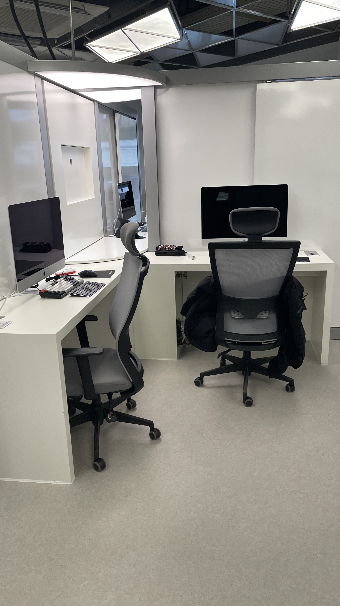
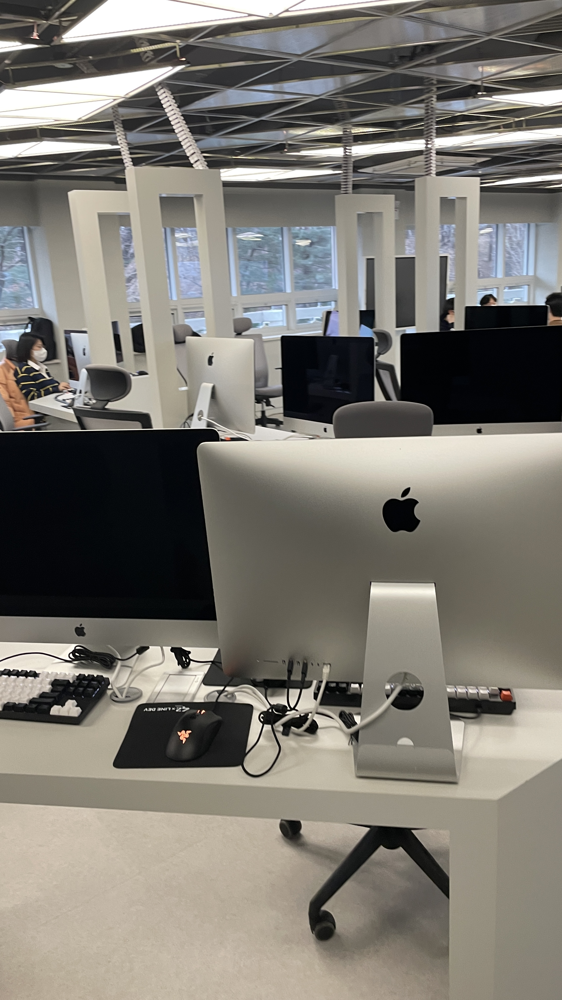
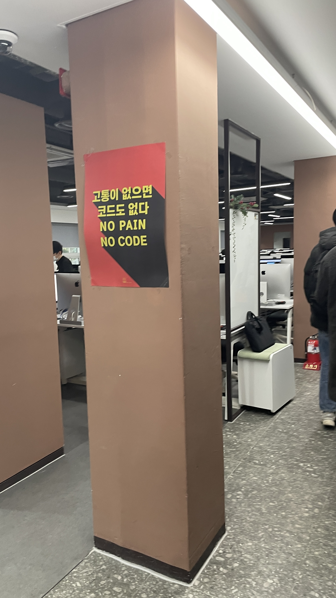

# Jan 16, 2023 

## What I did today.
1. 42SEOUL check-in meeting

  

### What I felt today.
오늘은 체크인 미팅을 하러 개포동 클러스터로 갔다.

QR코드를 찍고 간단한 신원 확인 및 참여하고 있는 정부 지원 사업이 있는 지 물어보셨다.
나한테 해당될 만한 내용은 국취제, 소마 정도였는데 
나는 국민취업지원제도를 하고 있어서 만약 지원금 수급 일정이 겹치게 되면 양자택일을 해야한다고 했고 소마는 지원금 문제가 아닌 아예 중복 신청이 불가하다고 했다.

그리고 지하 1층에서 교육과정 설명회를 한다고 해서 참여했다. 
폴라베어님이 진행하셨고 42서울 창시 이래 2번째 오프라인 미팅이라고 하셨다. 
42서울에서 진행한 첫 체크인 미팅과 오늘이였다. 
새삼 코로나가 얼마나 심했는 지 깨달았다. 

1시간 가량 설명하셨고 내용을 내가 이해한 바로 요약해보자면

1. 42서울에서는 동료에게서 배운다. (동료학습)
2. 42서울은 학비,학위,교수가 없는 대학교와 같다. 
3. 42서울은 코딩에 몰입할 수 있는 좋은 기회다.
4. 동아리 활동이 존재하며, 미션 성공 시 굿즈를 구매할 수 있는 포인트를 제공하는 게임같은   시스템으로 설계되었다.
5. 라피신에 통과해서 본과정을 밟게되면 블랙홀이라는 기간을 주고 기간이 지나면 퇴학 당하는 시스템이 있다. 미션에 통과하면 블랙홀 기간을 늘려준다.
6. 42서울 라피신 온라인 신청은 체크인 미팅 온라인 신청보다 훨씬 치열하다.
  [네이비즘 서버 시간](https://time.navyism.com/?host=apply.42seoul.kr)에 따르면 라피신 8기2차 기간이였던 9월달에 4460hit가 찍혀있는 것을 볼 수 있다. 체크인 미팅은 1515hit..
7. 지원금은 클러스터에서 일정 시간을 채워야 준다.

여담으로는 1기 취업률이 86% 정도라고 하셨다. 
그리고 취업이 될까 걱정하기 보다는 어디에 취업할까를 생각하라고 하셨는데 개인적으로 너무나 공감이 되었다. 
42서울에서 좋은 교육과정을 제공하고 나는 그에 맞춰 노력하면 취업이 안될 것이라는 상상을 해본 적이 없었다. 
오히려 웹과정이 아닌 인공지능이나, 데이터쪽으로 가볼까란 생각을 하고 있었다.

이 밖에도 이야기가 많았는데 내가 개념적으로 이해한 내용들이라 내 기억장치에 넣지 않아서 기억이 안난다.

그리고 클러스터 구경을 했는데 !

이 아이맥들 다 얼말까..

42서울 브이로그에서 본 사진 ㅋㅋ

사진이 정신없게 나왔는데 각잡고 찍으면 뭔가 동선에 방해될까봐 이렇게 찍었다..

공부하고 계신 분들이 동의하셨다해서 괜찮을까 싶었는데 막상 공부하는 분들을 보니까 뭔가 구경하는 게 미안해졌다. 
그리고 역시 42서울이다 싶었던 것은 동료학습을 추구하는 만큼 역시나 동료들이 똘똘 뭉쳐있었다. 
나도 42서울에 들어가면 인싸가 될래요.

누구나 그렇겠지만 본과정에 들어가면 정말 열심히, 잘할 자신이 있다.
라피신 신청이 가장 큰 역경이고 라피신에서 생존이 다음 스텝이다.

안되면 10기 지원해야지 !
